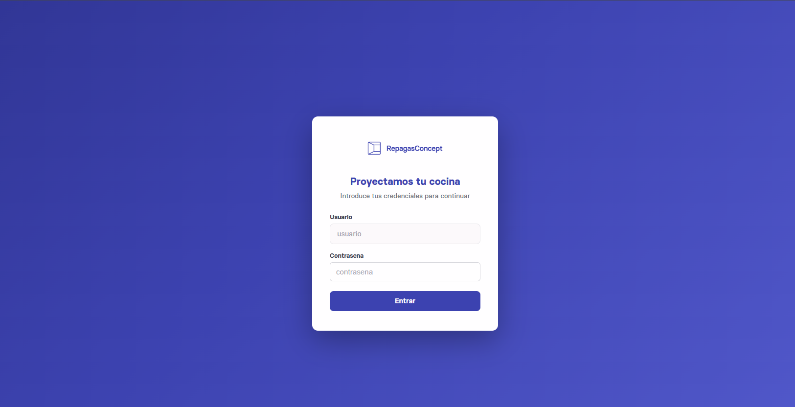
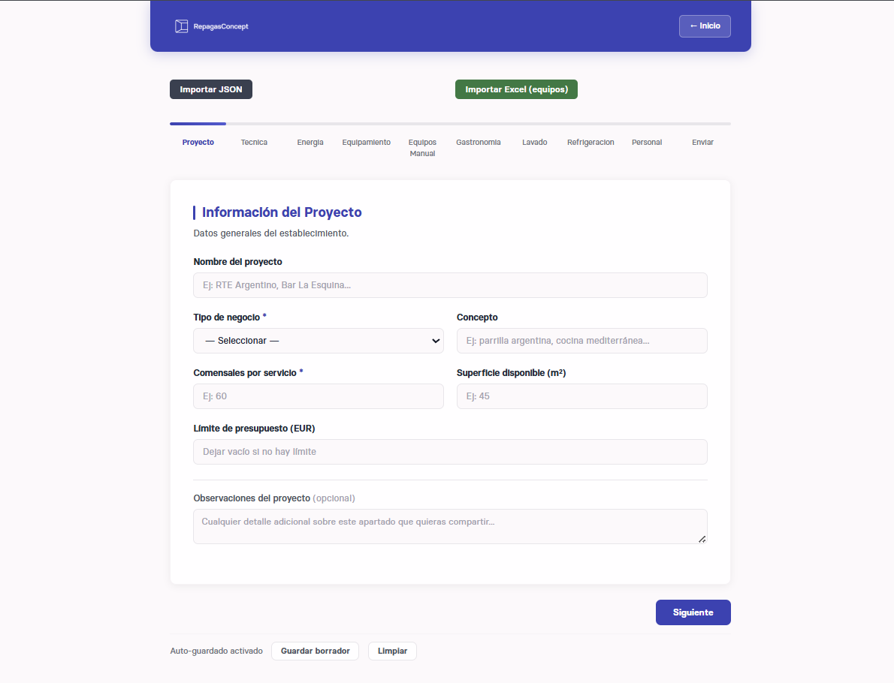
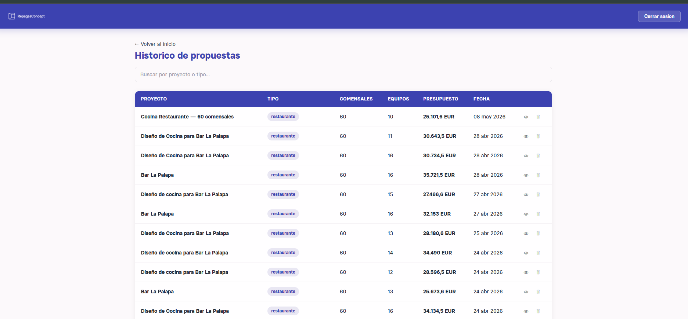
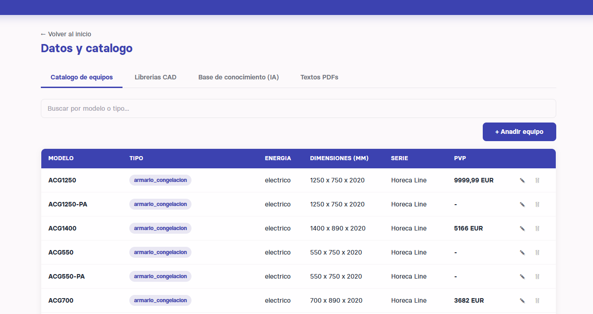

# Disenador de propuestas CAD — Repagas (version demo)

Pipeline FastAPI que genera planos AutoCAD (DXF/DWG) y PDFs de propuesta y presupuesto para cocinas industriales a partir de un formulario web. Backend con RAG vectorial e IA generativa.

> ⚠️ **Aviso importante**
>
> Este repositorio es una **version simplificada y open-source** de **RepagasConcept**, el software que [Repagas](https://www.repagas.com) usa en produccion para disenar cocinas industriales. La empresa es real; el proyecto que ves aqui es una plantilla con catalogo y planos **ficticios**, pensada para que sirva de referencia tecnica e inspiracion. **Los modelos de equipos cargados son inventados** (marca `AcmeKitchen`, modelos `AK-COC-XXX`), no representan el catalogo real de Repagas.
>
> El **frontend** incluido aqui es un **formulario basico de referencia**: la idea es que cualquiera pueda partir de el como plantilla y adaptarlo a su propio branding/flujo. El frontend que Repagas usa en produccion es mas completo y esta integrado con su proceso comercial; lo que esta en este repo cumple su funcion como demo end-to-end, pero no es representativo del producto real.

## Capturas

| | |
|---|---|
|  |  |
| **Login** — Acceso al panel. Autenticacion sencilla contra variables de entorno, pensada como ejemplo y facil de sustituir por algo production-grade (JWT, OAuth, Auth0). | **Formulario** — Wizard de 10 pasos para capturar el brief del proyecto (datos generales, parte tecnica, energia, equipamiento, gastronomia, lavado, refrigeracion, personal, envio). Soporta autoguardado en localStorage e importacion desde JSON / Excel. |
|  |  |
| **Historico** — Listado de propuestas generadas previamente, con descarga del ZIP de salida y opcion de modificar a partir de una propuesta existente. | **Datos y catalogo** — Panel admin para gestionar el catalogo de equipos, las librerias CAD, la base de conocimiento (RAG con embeddings Gemini) y los textos editables de los PDFs (intro de prospeccion, condiciones del presupuesto, etc.). |

## Que hace

A partir de un formulario web con los datos del proyecto (tipo de negocio, comensales, plano del local opcional, energia disponible, etc.), el sistema:

1. Decide los equipos necesarios consultando el catalogo + RAG semantico sobre manuales/catalogos indexados.
2. Si subes un plano del local en DXF/DWG, lo analiza para detectar paredes y zonas, y posiciona los equipos contra esas paredes con un algoritmo apoyado en few-shot de patrones profesionales.
3. Genera el plano final en DXF y DWG nativo de AutoCAD, un render PNG de preview, un PDF de prospeccion (analisis tecnico) y un PDF de presupuesto comercial con descuentos.
4. Empaqueta todo en un ZIP y lo devuelve al usuario. La propuesta queda guardada en historico.

Toda la propuesta se puede iterar despues por chat ("mueve la barbacoa a la izquierda", "cambia la freidora", "aplica 10% de descuento") y se regenera al vuelo.

## Stack

- **Backend**: Python 3.13, FastAPI, ezdxf, fpdf2
- **Base de datos**: PostgreSQL + [pgvector](https://github.com/pgvector/pgvector) (RAG semantico)
- **IA generativa**: Google Gemini 2.5 Pro (con rotacion de keys + fallback OpenRouter)
- **CAD nativo**: [LibreDWG](https://www.gnu.org/software/libredwg/) (compilado en Docker) para conversion DXF ↔ DWG
- **Frontend**: HTML + CSS + JS vanilla (sin frameworks)
- **Deploy**: Dockerfile multi-stage (Railway, Fly, Render, o cualquier hosting que acepte containers)

## Casos de uso reales

- **Estudios de cocina industrial / consultores**: generar propuestas tecnicas en minutos en lugar de horas.
- **Distribuidores de equipamiento hostelero**: ofrecer al cliente final un disenador automatico que use su catalogo.
- **Equipos comerciales**: convertir el briefing del cliente en una propuesta completa (plano + presupuesto) en una unica sesion.
- **Punto de partida para automatizar cualquier dominio CAD**: el patron `formulario → IA + RAG → CAD nativo + PDFs` se puede adaptar a interiorismo, retail layout, distribucion industrial, etc.
- **Base para evaluar viabilidad tecnica**: si te planteas un proyecto similar, este repo demuestra que el flujo end-to-end funciona y por que cada pieza esta donde esta.

## Como funciona por dentro

```
Formulario web (HTML)
     │  POST /generar (FormularioCliente JSON [+ plano DXF])
     ▼
FastAPI backend
     ├─► RAG Postgres + pgvector (catalogos indexados)         ─┐
     ├─► Gemini 2.5 Pro (Structured Output)  ◄──────────────────┘
     ├─► Resolver vs catalogo equipos (Postgres)
     ├─► Si hay plano: analizar_plano + posicionar_equipos
     ├─► Insertar bloques CAD (ezdxf) + conversion DWG (LibreDWG)
     ├─► Render PNG (matplotlib + ezdxf drawing)
     └─► PDFs Prospeccion + Presupuesto (fpdf2)
     │
     ▼ ZIP completo + auto-correccion visual (Gemini Vision)
```

El loop de auto-correccion compara el PNG generado con planos FINAL profesionales (few-shot) y, si detecta overlaps o errores de posicionamiento, reinyecta feedback a Gemini hasta 5 veces.

## Requisitos previos

- Python 3.13+
- PostgreSQL 15+ con la extension [pgvector](https://github.com/pgvector/pgvector)
- (Opcional) Docker para LibreDWG. Sin LibreDWG el sistema sigue funcionando, pero solo genera DXF (no DWG nativo).
- Una API key de Google Gemini ([aistudio.google.com](https://aistudio.google.com/app/apikey))

## Como usarlo

### 1. Setup local

```bash
# 1.1 Clona el repo
git clone <esta-url>
cd disenador_propuestas_cad_repagas

# 1.2 Crea la base de datos y carga el schema demo
createdb kitchen_demo
psql kitchen_demo -c "CREATE EXTENSION vector;"
psql kitchen_demo < demo_assets/schema.sql
# → 40 equipos ficticios cargados, listos para probar

# 1.3 Dependencias
python -m venv .venv
source .venv/bin/activate   # Windows: .venv\Scripts\activate
pip install -r requirements.txt

# 1.4 Configura el entorno
cp .env.example .env
# edita .env con tus credenciales (BD, GEMINI_API_KEY, etc.)
```

### 2. Arranca el backend

```bash
cd server
uvicorn webhook_server:app --reload --port 8000
# Backend en http://localhost:8000
# Docs Swagger en http://localhost:8000/docs
```

### 3. Configura y abre el frontend

El frontend es estatico y lee la URL del backend desde un `config.js` propio:

```bash
cd formulario-repagas
cp config.js.example config.js
# edita config.js: window.APP_CONFIG.API_URL = "http://localhost:8000"
```

Sirve la carpeta `formulario-repagas/` con cualquier servidor estatico:

```bash
python -m http.server 5500 --directory formulario-repagas
# → http://localhost:5500
```

### 4. Genera tu primera propuesta

Abre `http://localhost:5500`, completa los 10 pasos del formulario, sube un plano DXF/DWG opcional (puedes usar `demo_assets/demo_floor_plan.dxf`) y dale a generar. El sistema devuelve un ZIP con todos los archivos.

### Ejemplo rapido con `curl`

```bash
curl -X POST http://localhost:8000/generar \
  -H "Content-Type: application/json" \
  -d '{
    "proyecto": {
      "nombre": "Bar Demo",
      "tipo_negocio": "bar",
      "comensales": 60,
      "superficie_m2": 45
    },
    "energia": {"tipo_energia": "gas"},
    "necesidades_equipamiento": {
      "coccion": ["paellero", "barbacoa", "freidora"]
    }
  }' \
  -o propuesta.zip
```

## Estructura del proyecto

El backend sigue una **arquitectura feature-based** (vertical slice): cada dominio de negocio vive en su propio modulo cerrado dentro de `server/features/`, y la infraestructura compartida (config, BD) en `server/core/`. Esto facilita escalar el codigo: anadir un feature nuevo es crear una carpeta, no tocar archivos enormes.

```
.
├── server/                              # Backend FastAPI
│   ├── main.py                          # Entrypoint + routers + endpoints HTTP
│   ├── core/                            # Infraestructura compartida
│   │   └── database.py                  # Conexion Postgres (get_db_connection)
│   ├── features/                        # Cada dominio como modulo cerrado
│   │   ├── propuestas/                  # Generacion: LLM + resolver + schemas
│   │   │   ├── schemas.py               # Pydantic (FormularioCliente, PropuestaEquipos, ...)
│   │   │   ├── llm.py                   # Gemini + rotacion de keys + fallback OpenRouter
│   │   │   └── resolver.py              # Consulta del catalogo (resolver_equipos)
│   │   ├── planos/                      # Todo lo CAD
│   │   │   ├── analizar.py              # Parser DXF del cliente (paredes, zonas)
│   │   │   ├── posicionar.py            # Algoritmo + few-shot patrones FINAL
│   │   │   ├── integrar.py              # Insercion bloques CAD + render PNG
│   │   │   ├── generar.py               # Generacion DXF (standalone + integrado)
│   │   │   └── conversion.py            # DXF <-> DWG (LibreDWG / ODA)
│   │   ├── documentos/                  # Generacion de PDFs y tablas
│   │   │   ├── pdf.py                   # Prospeccion + Presupuesto (fpdf2)
│   │   │   └── tabla.py                 # Tabla de equipos en DWG
│   │   └── rag/                         # Base de conocimiento (semantic search)
│   │       └── pipeline.py              # ETL + embeddings + busqueda vectorial
├── formulario-repagas/             # Frontend (HTML+CSS+JS vanilla)
│   ├── index.html, formulario.html, historico.html, admin.html
│   ├── app.js, auth.js, styles.css
│   ├── config.js.example           # Plantilla de config (URL backend)
│   └── _redirects.example          # Plantilla de proxy Netlify (opcional)
├── demo_assets/                    # Recursos demo (catalogo + CAD sinteticos)
│   ├── schema.sql                  # Schema + seed 40 equipos ficticios
│   ├── demo_blocks.dxf             # Libreria CAD sintetica
│   ├── demo_floor_plan.dxf         # Plano de ejemplo 10x6m
│   ├── bloque_map.json             # Mapeo bloques -> dimensiones
│   └── patrones_profesionales.json # Patrones few-shot para posicionamiento
├── Dockerfile                      # Multi-stage con LibreDWG compilado
├── requirements.txt
├── .env.example
└── README.md
```

## Variables de entorno

Ver `.env.example` para la lista completa. Las criticas:

| Variable | Para que |
|---|---|
| `SUPABASE_DB_*` | Conexion a Postgres (puede ser local o Supabase cloud) |
| `GEMINI_API_KEY` y `GEMINI_API_KEY_LLM` | Key principal de Google Gemini |
| `GEMINI_API_KEY_2..4` | Rotacion opcional para evitar limites del tier gratuito |
| `OPENROUTER_API_KEY` | Fallback opcional si Gemini cae |
| `APP_LOGIN_USER` y `APP_LOGIN_PASS` | Credenciales del panel admin (auth simple, ver siguiente seccion) |

## Autenticacion

El sistema incluye un **login simple** (usuario/contrasena contra variables de entorno) en el frontend, principalmente para proteger el panel admin (catalogo, RAG, textos PDFs). Es **ilustrativo, no production-grade**: si vas a desplegarlo en internet con datos reales, sustituyelo por algo mas serio (JWT con expiracion, OAuth, Auth0, etc.).

El frontend incluido en `formulario-repagas/` es una **plantilla de referencia**. Si lo usas para tu proyecto, lo normal es que lo rediseñes a tu gusto (branding, UX, flujo) — esta version sirve para ver como conectar el backend end-to-end y como esta organizado el formulario por pasos.

## Ideas para extenderlo

- **Auth real**: cambiar el login simple por OAuth (Google/GitHub) o JWT con expiracion.
- **Multi-tenant**: separar catalogos y plantillas por organizacion.
- **Mas idiomas**: el sistema esta en espanol; aniadir EN/FR es directo (los textos vienen de `textos_config` en BD).
- **Mejor UI**: el frontend es vanilla — pasarlo a React/Vue daria mas flexibilidad.
- **Mas integraciones CAD**: la libreria de bloques es modular; aniadir mas equipos es solo SQL + un nuevo bloque en el DXF.
- **Stripe / billing**: cobrar por propuesta generada, plan mensual, etc.
- **Auto-deploy de catalogos**: indexar PDFs nuevos del fabricante automaticamente en el RAG via cron job.

## Contribuir

Issues y PRs bienvenidos. Si tienes ideas concretas o encuentras un bug, abre un issue describiendo el caso de uso.

## Agradecimientos

A [Repagas](https://www.repagas.com), que conto conmigo para construir la version real de este sistema en produccion. Esta version simplificada vive como referencia tecnica para que cualquiera pueda inspirarse en la arquitectura.

A las librerias open-source que hacen posible el proyecto: [ezdxf](https://github.com/mozman/ezdxf), [LibreDWG](https://www.gnu.org/software/libredwg/), [pgvector](https://github.com/pgvector/pgvector), [FastAPI](https://fastapi.tiangolo.com/), [fpdf2](https://github.com/py-pdf/fpdf2).

## Licencia

MIT — ver [LICENSE](LICENSE). Puedes usar, modificar y distribuir este codigo (incluso comercialmente). Solo se pide mantener el aviso de copyright.

---

Hecho con cafe en Bogota por Jeisson.
